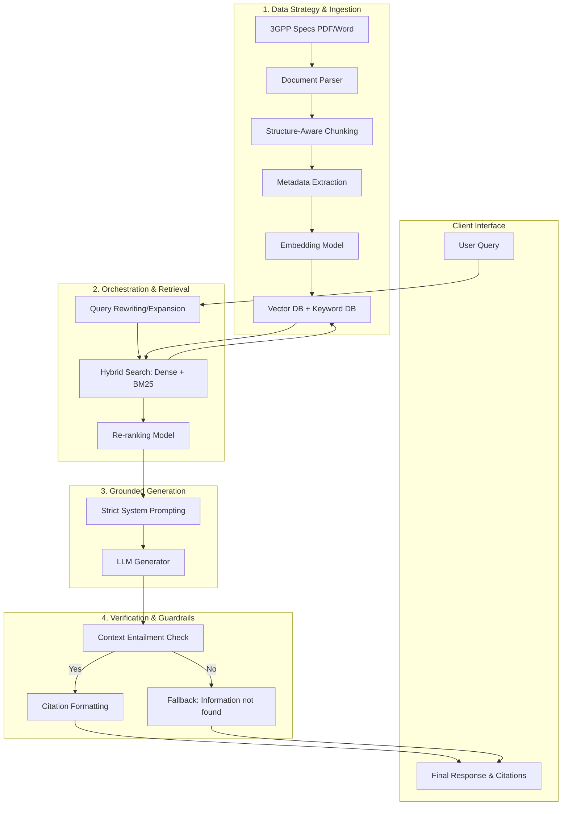

# 📡 3GPP RAG Chatbot (Near-Zero Hallucination Telecom Assistant)

[](https://maverinassignment-ewwskm3xkc3llqhefkpjmd.streamlit.app/)
[](https://www.python.org/downloads/)
[](https://python.langchain.com/docs/langgraph/)
[](https://groq.com/)

An production-grade Retrieval-Augmented Generation (RAG) chatbot specialized in **3GPP Telecommunications Standards** (5G NR, LTE, RRC, NAS protocols). Engineered with an agentic state machine to enforce **near-zero hallucinations**, persistent session memory, multi-model LLM fallbacks, and a dark-themed Streamlit web interface.

🌐 **Live Demo Application**: [3GPP RAG Chatbot on Streamlit Cloud](https://maverinassignment-ewwskm3xkc3llqhefkpjmd.streamlit.app/)

---

## 🌟 Key Features

* 🛡️ **Near-Zero Hallucination Guardrails**: Combines document relevance grading with strict system prompts. If a query is out-of-domain (e.g. general knowledge), the guardrail safely intercepts it and responds with explicit specification boundaries instead of making up answers.
* 🔄 **Multi-Model LLM Resilience**: Built with dynamic fallback handling via Groq API. If the primary model encounters rate limits or downtime, it automatically fails over:
  `Llama-3.3-70b-versatile` ➡️ `Llama-3.1-8b-instant` ➡️ `Qwen-3-32b` ➡️ `Qwen-3.6-27b`
* 💾 **Persistent Multi-Session Memory**: SQLite checkpointer integration (`langgraph-checkpoint-sqlite`) saves session state locally. Users can view, switch between, and continue past conversation threads via the interactive sidebar.
* ⚡ **High-Efficiency CPU Embeddings**: Powered by FastEmbed (`BAAI/bge-small-en-v1.5`) and an embedded Qdrant vector database (`qdrant_db`) for fast retrieval without external vector cloud dependencies.
* 📄 **Structure-Aware Chunking**: Ingests 3GPP `.docx` specifications respecting clause boundaries, section numbers, and Release metadata tags.
* 🎨 **Minimal Dark Theme UI**: Sleek, modern dark-mode interface built with Streamlit for optimal readability.

---

## 🏗️ Architecture & Workflow



For the complete architectural design breakdown, refer to [rag_architecture_workflow.md](rag_architecture_workflow.md) and [vedio.txt](vedio.txt).

---

## 🛠️ Technology Stack

| Layer | Technology | Usage |
| :--- | :--- | :--- |
| **Agentic State Machine** | `LangGraph` | Manages nodes (`retrieve`, `grade_documents`, `generate`, `fallback`) |
| **LLM Provider** | `Groq API` | High-throughput inferencing for Llama 3.3/3.1 & Qwen models |
| **Embeddings** | `FastEmbed` | CPU-optimized `BAAI/bge-small-en-v1.5` embeddings |
| **Vector Store** | `Qdrant` | Embedded local vector database stored in `qdrant_db/` |
| **Session Persistence** | `SQLite` | Persistent memory managed by `langgraph-checkpoint-sqlite` |
| **Observability** | `LangSmith` | Real-time query tracing, latency, and token monitoring |
| **Frontend Framework** | `Streamlit` | Web user interface with custom dark theme (`.streamlit/config.toml`) |

---

## 📁 Repository Structure

```
Maverin_assignment/
├── app.py                      # Main Streamlit web application & LangGraph pipeline
├── requirements.txt            # Python dependencies for deployment
├── .streamlit/
│   └── config.toml             # Custom dark theme configuration
├── qdrant_db/                  # Embedded Qdrant vector database (3GPP embeddings)
├── checkpoints.sqlite          # Persistent SQLite database for multi-session chat history
├── test_demo.txt               # 10 Test scenarios (In-domain queries & out-of-domain guardrail tests)
└── .gitignore                  # Optimized Git ignore rules
```

---

## 🚀 Quickstart (Local Setup)

### 1. Clone the Repository
```bash
git clone https://github.com/Uzumaki-tushar/Maverin_assignment.git
cd Maverin_assignment
```

### 2. Install Dependencies
```bash
pip install -r requirements.txt
```

### 3. Configure API Keys
Create a `.env` file in the root directory (or set up Streamlit Secrets):
```env
GROQ_API_KEY=your_groq_api_key
LANGCHAIN_API_KEY=your_langchain_api_key  # Optional for tracing
```

### 4. Launch the Streamlit App
```bash
streamlit run app.py
```
Open `http://localhost:8501` in your browser.

---

## 🧪 Test Scenarios

Try these query scenarios in the chatbot interface:

| Scenario Type | Sample Query | Expected Behavior |
| :--- | :--- | :--- |
| **In-Domain Query** | *"What is the procedure for RRC Connection Re-establishment in 5G NR?"* | Returns accurate technical procedure with clause citations (e.g., TS 38.331). |
| **In-Domain Query** | *"Explain the role of UPF in 5G Core architecture."* | Answers using retrieved specification context. |
| **Out-of-Domain Guardrail Test** | *"How do I bake a chocolate cake?"* | Intercepted by document grader. Returns: *"The provided 3GPP specifications do not contain information to answer this query."* |


---

## 📄 License
Distributed under the MIT License. See `LICENSE` for details.
