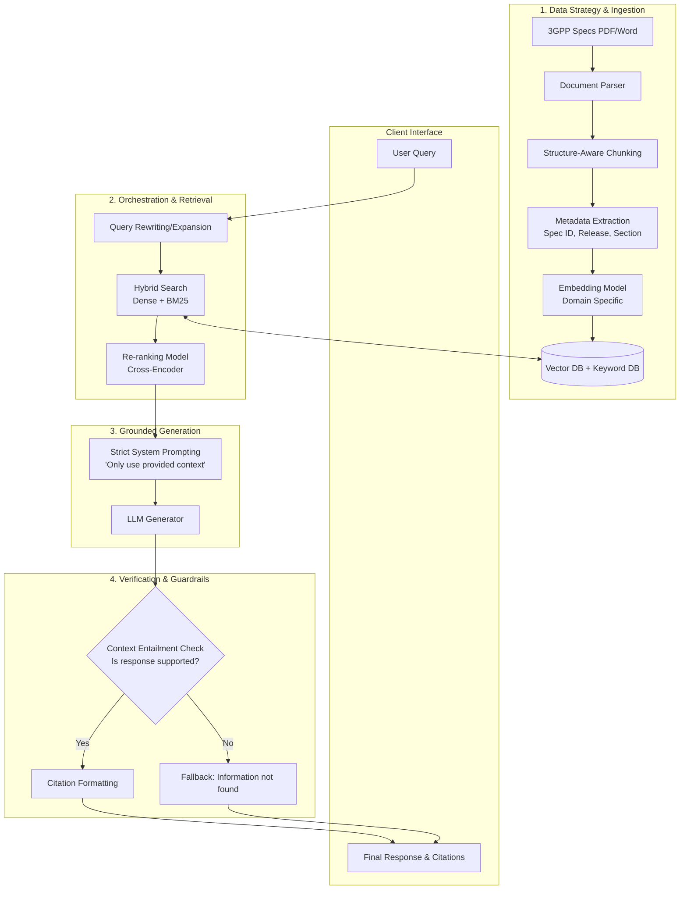

# 3GPP RAG Chatbot Architecture Workflow

This document outlines the architectural approach for building a Retrieval-Augmented Generation (RAG) chatbot focused on Telecom 3GPP standards, with a critical requirement for near-zero hallucinations. 

We approach this AI architecture problem through a structured workflow: Data Strategy, Retrieval Design, Generation, and Output Verification (Guardrails).

## Architectural Breakdown for Near-Zero Hallucination

### 1. Data Strategy & Ingestion
To minimize hallucinations, the data must be highly structured. 
* **Structure-Aware Chunking:** 3GPP documents are highly technical, structured, and numbered. Chunks must respect section boundaries rather than arbitrary character limits to preserve context.
* **Metadata Extraction:** Tagging chunks with Release (e.g., Rel-17), Spec Series (e.g., 38.331), and section numbers. This allows for precise filtering before semantic search.

### 2. Orchestration & Retrieval
Poor retrieval is the leading cause of RAG hallucinations. If the LLM doesn't get the right facts, it guesses.
* **Hybrid Search:** Combining keyword search (BM25) with semantic vector search. Telecom terms often involve specific acronyms (e.g., "RRC", "NAS", "UPF") where exact keyword matching outperforms semantic matching.
* **Re-ranking:** A Cross-Encoder re-evaluates the retrieved chunks against the query to ensure only the most relevant, highly-correlated chunks are passed to the LLM.

### 3. Grounded Generation
* **Strict Prompting:** The LLM must be explicitly instructed: *"You are a strict 3GPP standards expert. Answer ONLY using the provided context. If the context does not contain the answer, reply exactly with 'The provided 3GPP specifications do not contain information to answer this query.' Do not use outside knowledge."*

### 4. Verification & Guardrails (The Hallucination Filter)
* **Context Entailment Check (Self-Reflection / NLI):** Before returning the response, a secondary check (using a smaller, fast NLI model or the LLM itself) verifies if every claim in the generated response is strictly entailed by the retrieved chunks.
* **Mandatory Citations:** Forcing the model to quote the specific 3GPP spec and section number for every claim. If it cannot cite it, the claim is removed.
